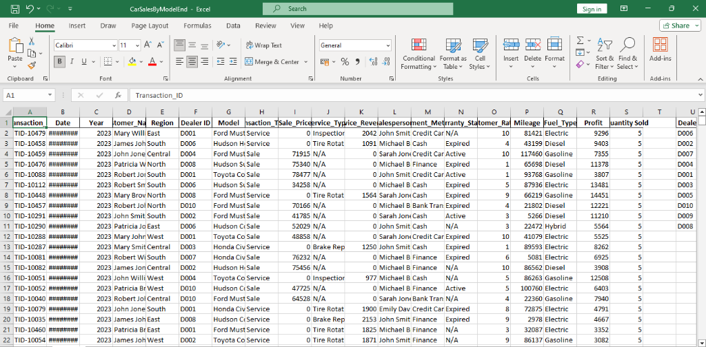
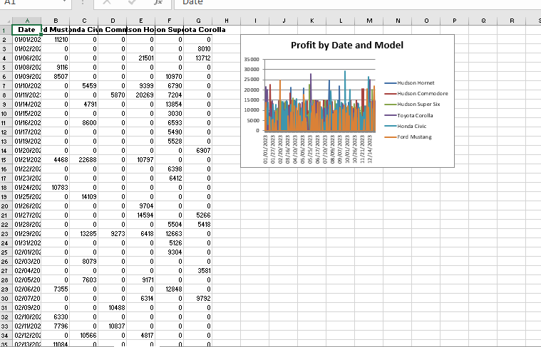
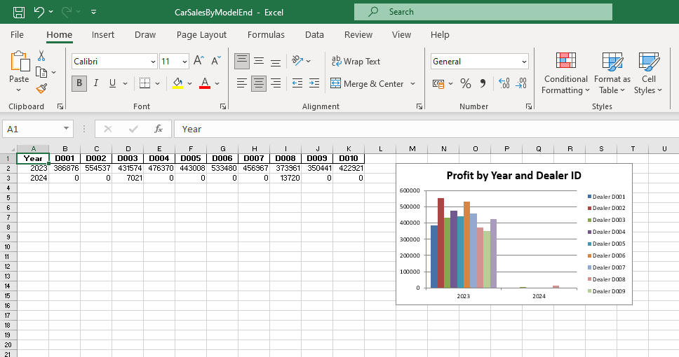
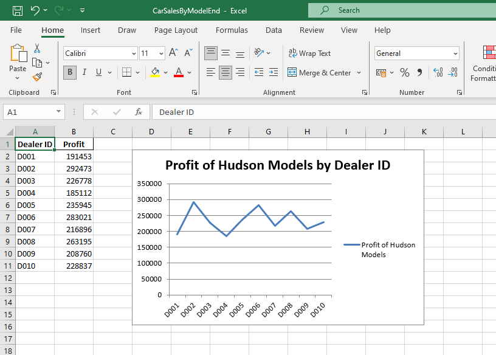

# Car Sales Analytics Project

This project generates car sales data and provides an interactive dashboard.

## 📖 About the Project
This is an **End-to-End Sales & Customer Analytics** project designed to track dealership performance and customer satisfaction. The project uses a synthetic dataset of 500 records to simulate real-world automotive business scenarios.

**Key Analytical Focus:**
*   **Sales Performance**: Tracking revenue and profit across 10 different Dealer IDs.
*   **Model Comparison**: Analyzing which car models (like the Hudson Hornet or Ford Mustang) are top performers.
*   **Service Operations**: Monitoring service types (Oil Changes, Brake Repairs) and their revenue impact.
*   **Customer Insights**: Evaluating ratings and mileage across different regions.

Generated data is exported to a multi-sheet Excel file with automated charts and visualized through a real-time Streamlit dashboard.

## 🛠️ Tools & Technologies
The following tools were used to build this project:

*   **Python**: Core programming language.
*   **Pandas**: For data generation, cleaning, and aggregation.
*   **Streamlit**: For creating the interactive web dashboard interface.
*   **Plotly**: To build dynamic and interactive charts (Bar, Line, Pie).
*   **XlsxWriter**: To programmatically create the Excel file with embedded charts and formatting.
*   **VS Code**: Integrated Development Environment (IDE) with custom launch configurations.
*   **Excel**: For final output reporting and data storage.

## 📊 Project Previews





## 🚀 How to Run

1. **Step 1**: Install requirements
   ```bash
   pip install streamlit pandas plotly openpyxl xlsxwriter
   ```

2. **Step 2**: Generate Data
   ```bash
   python generate_data.py
   ```

3. **Step 3**: Start Dashboard
   ```bash
   python -m streamlit run dashboard.py
   ```

---
*Created for the Final Sale Assignment.*
